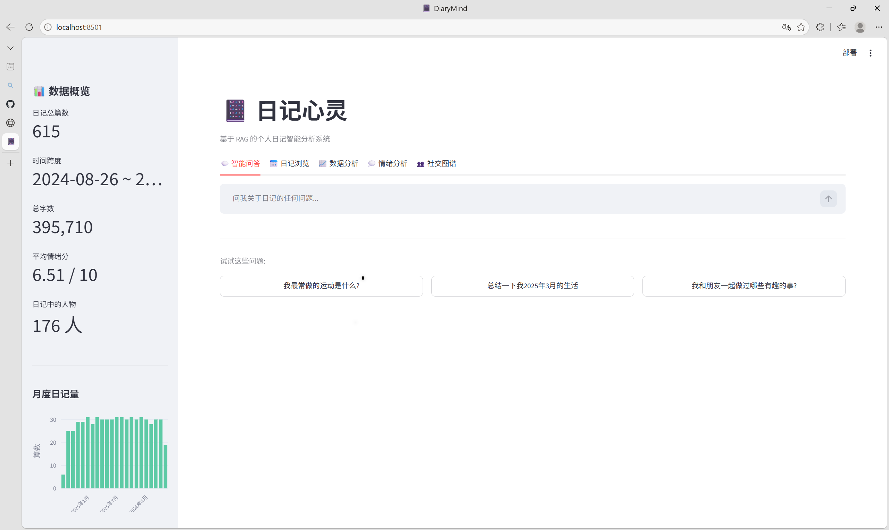
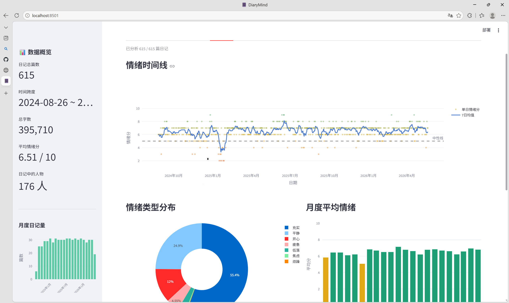
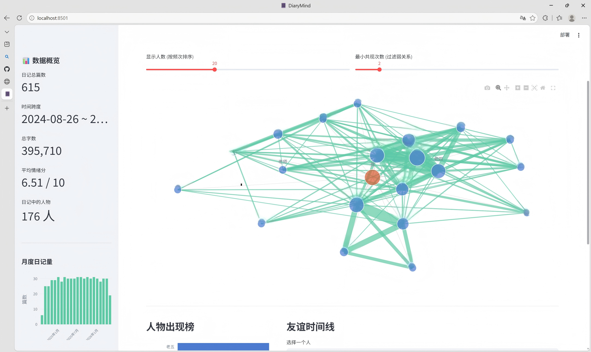

# 📔 DiaryMind — 基于 RAG 的个人日记智能分析系统

> 把两年的个人日记(615 篇 / 39 万字)变成一个可对话、可分析的私人知识库。

**核心功能:** 混合检索问答 (Hybrid RAG) · 情绪趋势分析 · 社交关系图谱 · 检索质量评测

⚠️ 出于隐私考虑,本仓库不包含任何日记数据。系统可处理任何符合格式的中文日记/笔记数据。

---

## ✨ 功能展示
###  智能问答 (Hybrid RAG)
用自然语言向日记提问,系统检索相关片段并生成带出处引用的回答:



> **Q:** 我和朋友一起做过哪些有趣的事?
> **A:** 从你的日记来看…… 1. 和朋友的公路旅行(2026年2月10日):你们一起开车上高速…… 2. ……

###  情绪分析
LLM 对每篇日记打情绪分(1-10)并归类情绪类型,生成 21 个月的情绪时间线、月度均值、情绪极值日回顾。



###  社交关系图谱
LLM 抽取日记中出现的人物(支持口语化称呼如绰号、姓氏简称),构建共现网络图,可视化社交圈层与"友谊时间线"。



## 📊 检索优化成果

通过失败案例分析发现纯向量检索对低频专有名词不敏感,实现 **BM25 + 向量 + RRF 融合**的混合检索后:

| 指标 | 纯向量检索 | 混合检索 | 提升 |
|------|-----------|---------|------|
| Recall@1 | 21.6% | **43.2%** | +21.6pp |
| Recall@3 | 40.5% | **64.9%** | +24.3pp |
| Recall@5 | 51.4% | **75.7%** | +24.3pp |
| Recall@10 | 62.2% | **94.6%** | +32.4pp |
| MRR | 0.325 | **0.578** | +77.8% |

*评测集:37 个由 LLM 生成、人工审核的事实性问题,ground truth 为问题来源日记的日期。*

---

## 🏗️ 系统架构

```
                       ┌─────────────────────────────────┐
                       │       Streamlit 前端              │
                       │  问答 / 浏览 / 情绪 / 图谱 / 统计   │
                       └────────────┬────────────────────┘
                                    │
              ┌─────────────────────┼─────────────────────┐
              ▼                     ▼                     ▼
     ┌─────────────────┐   ┌──────────────┐   ┌──────────────────┐
     │  Hybrid Search   │   │ 情绪分析模块   │   │  人物提取模块      │
     │                 │   │ (LLM 批量打分) │   │ (LLM NER + 对齐)  │
     │  ┌───────────┐  │   └──────┬───────┘   └────────┬─────────┘
     │  │ 向量检索    │  │          │                    │
     │  │ (ChromaDB │  │          └────────┬───────────┘
     │  │ +BGE-zh)  │  │                   ▼
     │  ├───────────┤  │          ┌──────────────────┐
     │  │ BM25 检索  │  │          │  DeepSeek API     │
     │  │ (jieba分词)│  │          │  (OpenAI 兼容格式) │
     │  ├───────────┤  │          └──────────────────┘
     │  │ RRF 融合   │  │
     │  │ + 日期去重  │  │
     │  └───────────┘  │
     └─────────────────┘
```

**技术选型理由:**

| 模块 | 技术 | 为什么 |
|------|------|--------|
| 向量数据库 | ChromaDB | 轻量、本地持久化、HNSW 索引 |
| Embedding | BGE-small-zh-v1.5 | 中文 C-MTEB 表现优秀,90MB 本地 CPU 可跑 |
| 关键词检索 | BM25 (rank-bm25 + jieba) | 补足向量检索对低频专有名词的盲区 |
| 融合策略 | RRF (k=60) | 不依赖分数量纲,只用排名,简单鲁棒 |
| LLM | DeepSeek API | 中文质量高、成本低、OpenAI 兼容 |
| 前端 | Streamlit + Plotly | 快速迭代,纯 Python 闭环 |

---

## 🚀 快速开始

### 1. 安装

```bash
git clone https://github.com/yourname/DiaryMind.git
cd DiaryMind
pip install -r requirements.txt
```

### 2. 配置

```bash
cp config.example.py config.py
# 编辑 config.py 填入 DeepSeek API Key (https://platform.deepseek.com/)
```

### 3. 准备数据

把你的日记整理成 `data/diary_structured.json`,格式:

```json
[
  {"date": "2024-08-26", "title": "标题", "content": "日记正文..."},
  ...
]
```

### 4. 建索引并启动

```bash
python vector_store.py          # 建向量索引(首次自动下载 embedding 模型)
streamlit run app.py            # 启动界面
```

### 5. 可选:运行分析模块

```bash
python sentiment_analysis.py            # 情绪分析(LLM 批量打分,支持断点续传)
python person_extraction.py             # 人物抽取
python person_extraction.py --merge     # 别名合并后生成人物统计
python evaluation.py --generate         # 生成检索评测集
python evaluation.py --run              # 跑评测(对比 vector vs hybrid)
```

---

## 📁 项目结构

```
DiaryMind/
├── config.example.py      # 配置模板(复制为 config.py 使用)
├── data_loader.py         # 数据加载与分块(标点感知 + 滑动窗口重叠)
├── vector_store.py        # ChromaDB 向量索引与检索
├── hybrid_search.py       # BM25 + 向量 + RRF 混合检索
├── rag_pipeline.py        # RAG 问答管线(检索 → prompt → 生成)
├── sentiment_analysis.py  # 情绪批量打分(并发 + 断点续传 + 重试)
├── person_extraction.py   # 人物抽取与实体对齐
├── evaluation.py          # 检索评测(Recall@k / MRR)
├── app.py                 # Streamlit 前端
└── requirements.txt
```

---

## 🔍 关键设计决策

**为什么用 LLM 做情绪分析和人物抽取,而不是传统 NLP 工具?**
日记是高度口语化的文本(绰号、emoji、网络用语)。传统情感分析模型和 NER 在这类文本上表现差,LLM 能结合上下文理解"练""老五"是人物称呼,并且一次调用同时输出分数、标签和理由。

**实体对齐怎么处理?**
同一人在日记中有多种称呼("苟豪林"/"苟")。方案:子串匹配自动生成候选映射 → 人工确认 → 程序归一化。在个人数据规模下,这比纯自动方案准确率更高。

**评测集如何避免人工标注成本?**
让 LLM 针对随机抽样的日记生成问题——问题来源的日记日期天然就是 ground truth,只需人工审核问题质量,无需标注答案出处。

**批量 LLM 调用的工程化?**
615 篇 × 多个任务 = 数千次 API 调用。统一采用:线程池并发(限流保护)、指数退避重试、定期落盘断点续传。

---

## 📄 License

MIT
